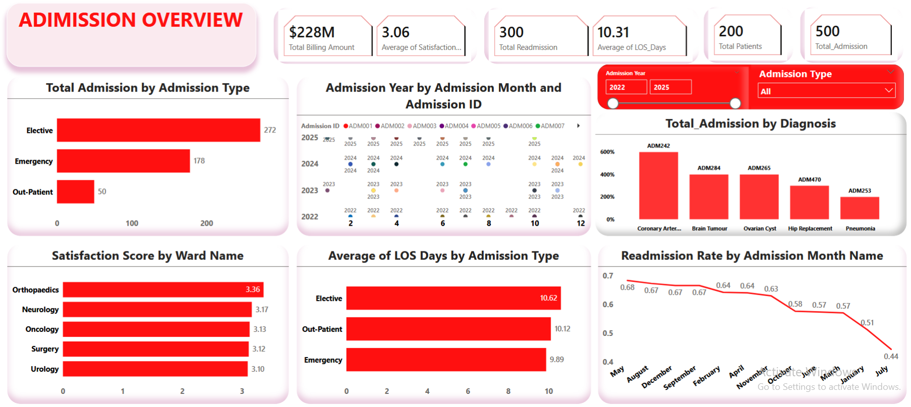
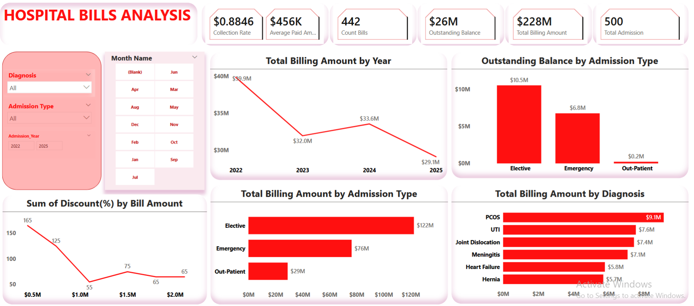
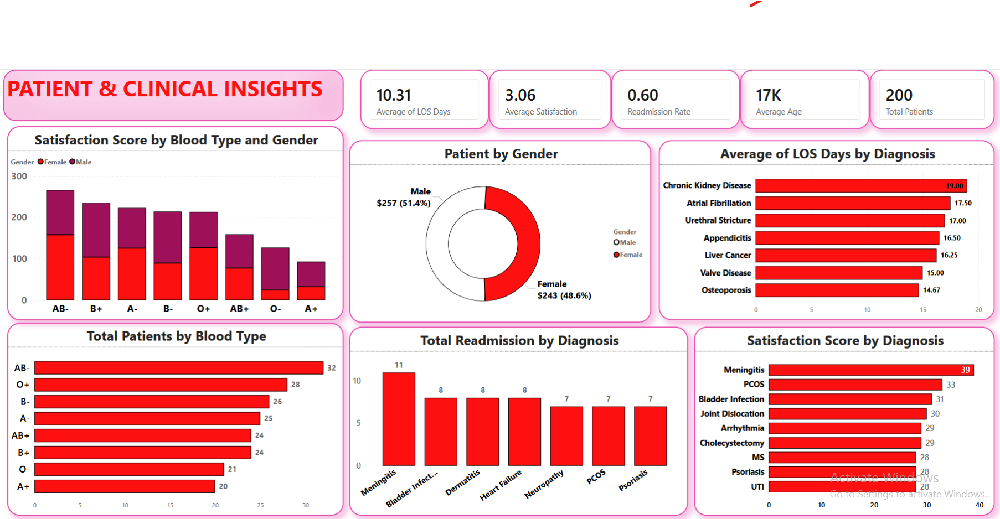
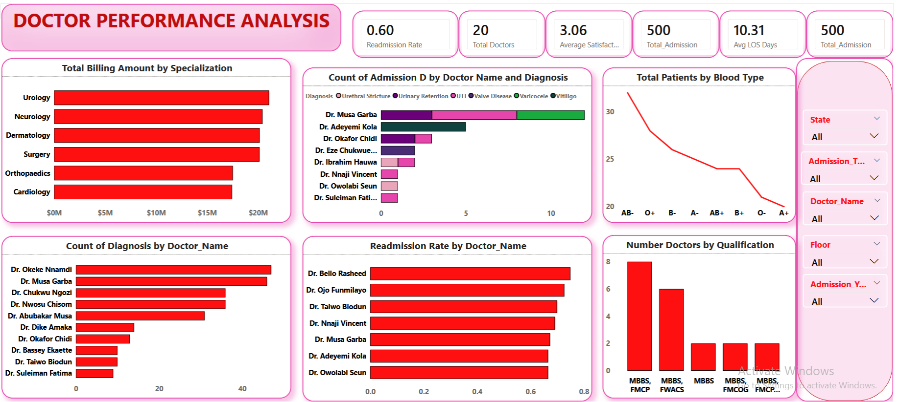
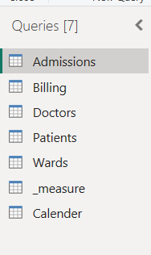
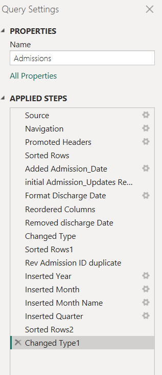
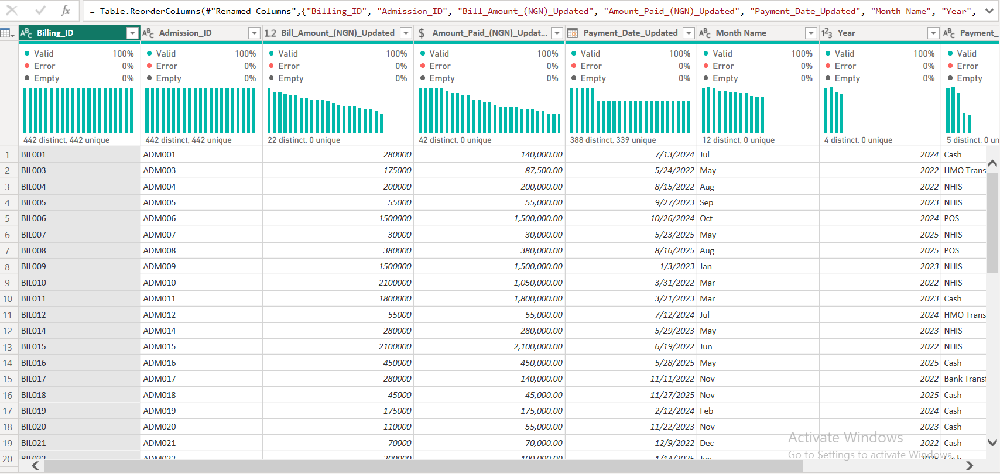
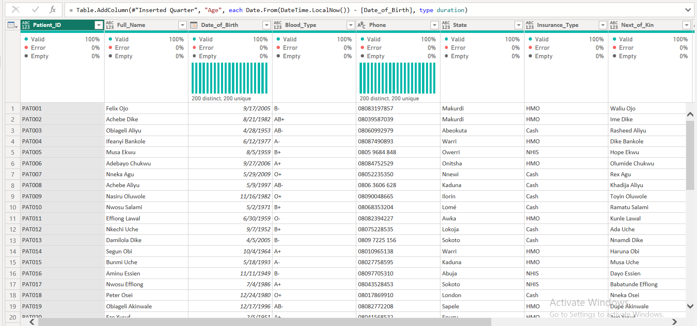
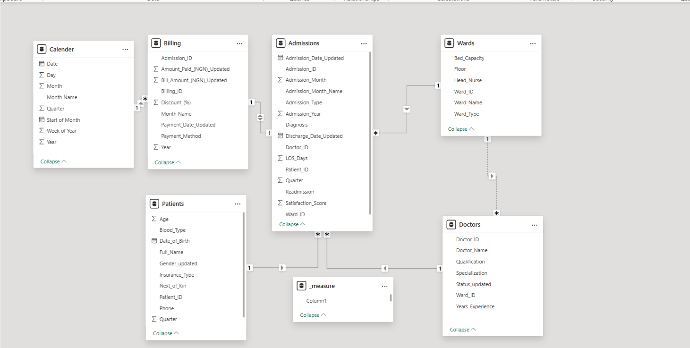

# Hospital-Analytics-Dashboard
An interactive Power BI dashboard that transforms hospital data into actionable business insights through data cleaning, modeling, DAX, and executive reporting.

# 🏥 Hospital Analytics Dashboard
### Transforming Raw Healthcare Data into Actionable Business Intelligence with Microsoft Power BI

<p align="center">


</p>

---

# 📖 Table of Contents

- [Project Overview](#-project-overview)
- [Business Challenge](#-business-challenge)
- [Project Objectives](#-project-objectives)
- [Dashboard Preview](#-dashboard-preview)
- [Dataset Overview](#-dataset-overview)
- [Project Workflow](#-project-workflow)
- [Data Preparation & Transformation](#-data-preparation--transformation)
- [Data Modeling](#-data-modeling)
- [Dashboard Walkthrough](#-dashboard-walkthrough)
- [Business Questions Answered](#-business-questions-answered)
- [Key Performance Indicators](#-key-performance-indicators)
- [Business Insights](#-business-insights)
- [Business Recommendations](#-business-recommendations)
- [Technical Skills Demonstrated](#-technical-skills-demonstrated)
- [Challenges Encountered](#-challenges-encountered)
- [Future Improvements](#-future-improvements)
- [Conclusion](#-conclusion)
- [Author](#-author)

---

# 📌 Project Overview

Healthcare organizations generate enormous amounts of operational, clinical, and financial data every day. Every patient admission, diagnosis, treatment, physician assignment, and billing transaction contributes to valuable information that can improve healthcare delivery and operational efficiency.

However, raw data alone cannot support strategic decision-making. Without an effective reporting system, hospital leaders often struggle to identify trends, monitor key performance indicators, evaluate physician performance, and understand financial outcomes.

This project presents a comprehensive **Hospital Analytics Dashboard** developed using **Microsoft Power BI**. The solution transforms raw hospital data into an interactive Business Intelligence platform that enables stakeholders to monitor hospital operations, evaluate financial performance, understand patient demographics, and measure physician productivity through intuitive dashboards and meaningful KPIs.

Rather than focusing only on visualization, this project follows the complete analytics lifecycle—from data preparation and transformation to data modeling, DAX calculations, dashboard development, and business storytelling.

---

# 🎯 Business Challenge

Hospital administrators and healthcare executives rely on timely and accurate information to make operational and financial decisions.

Questions such as the following are frequently asked:

- How many patients are admitted each month?
- Which diagnoses account for the highest number of admissions?
- How long do patients stay in the hospital?
- Which physicians manage the largest patient workload?
- What is the hospital's total revenue?
- How much revenue has been collected?
- What amount remains outstanding?
- Which wards receive the highest patient volume?
- How satisfied are patients with the quality of care?
- Which patient groups require additional healthcare resources?

Answering these questions manually across multiple spreadsheets and operational systems is inefficient, time-consuming, and prone to errors.

This project addresses these challenges by providing an interactive dashboard that consolidates hospital data into a single source of truth, enabling healthcare leaders to make informed, data-driven decisions.

---

# 🎯 Project Objectives

The primary objective of this project was to develop an interactive reporting solution capable of transforming complex hospital data into meaningful business insights.

The project aimed to:

- Clean and prepare raw healthcare data for analysis.
- Improve data quality through transformation and validation.
- Build a structured relational data model.
- Develop meaningful KPIs using DAX.
- Design intuitive dashboards for executive reporting.
- Monitor operational, financial, and clinical performance.
- Support strategic decision-making through interactive analytics.

---

# 📸 Dashboard Preview

## Executive Overview


---

## Billing & Revenue Analysis


---

## Patient & Clinical Insights



--
## Doctor Performance Analysis


---

# 📂 Dataset Overview

The dataset represents hospital operational activities and consists of multiple related tables that capture different aspects of healthcare operations.

### Core Tables

| Table | Description |
|--------|-------------|
| Admissions | Patient admission records including diagnosis, admission type, discharge information, and satisfaction score. |
| Patients | Patient demographic information including age, gender, blood group, insurance, and personal details. |
| Doctors | Physician information including specialization, experience, and department. |
| Billing | Hospital billing records including bill amount, amount paid, payment date, and payment method. |
| Wards | Hospital ward information used to monitor patient allocation and operational workload. |
| Calendar | Date dimension created to support time intelligence analysis. |

The relational structure enables accurate filtering, scalable reporting, and efficient analytical performance.

---

# 🔄 Project Workflow

This project followed a structured Business Intelligence workflow.

```text
Raw Hospital Data
        │
        ▼
Data Assessment
        │
        ▼
Power Query Transformation
        │
        ▼
Data Cleaning & Validation
        │
        ▼
Relational Data Modeling
        │
        ▼
DAX Measure Development
        │
        ▼
Interactive Dashboard Design
        │
        ▼
Business Insight Generation
        │
        ▼
Executive Decision Support
```

This workflow ensures that insights presented within the dashboard are built on clean, reliable, and well-structured data.

---

# 🧹 Data Preparation & Transformation

Before analysis, the dataset underwent a comprehensive data preparation process using **Power Query**.

Key transformation activities included:

- Standardizing inconsistent date formats.
- Converting billing columns to numeric data types.
- Correcting invalid data types.
- Removing duplicate records.
- Handling missing and blank values.
- Standardizing categorical values.
- Cleaning inconsistent text entries.
- Creating Year, Month, Quarter, and Month Name columns.
- Validating relationships between tables.
- Optimizing the dataset for reporting performance.

These transformations improved overall data quality and ensured accurate KPI calculations throughout the dashboard.

---

## Power Query Preview


## Admission Data Cleaning


## Billing Data Cleaning


## Patient Data Cleaning



---

# 🏗️ Data Modeling

A structured relational data model was implemented to improve report performance and analytical accuracy.

The solution consists of:

### Fact Tables

- Admissions
- Billing

### Dimension Tables

- Patients
- Doctors
- Wards
- Calendar

A dedicated Calendar table was introduced to support time-based analysis across all reports.

The model minimizes data redundancy, improves filtering behavior, and follows dimensional modeling principles commonly used in enterprise Business Intelligence solutions.

---

## Relationship Model



---

# 📊 Dashboard Walkthrough

## 📄 Page 1 — Admission Overview

This dashboard provides executives with an operational snapshot of hospital admissions and patient activity.

### Key Metrics

- Total Admissions
- Total Patients
- Average Length of Stay
- Average Satisfaction Score
- Readmission Rate

### Business Value

This page enables management to monitor patient demand, evaluate healthcare quality, identify admission trends, and understand disease distribution across the hospital.

## 💰 Page 2 — Billing & Revenue Analysis

This dashboard focuses on financial performance and revenue monitoring.

### Key Metrics

- Total Billing Amount
- Total Amount Paid
- Outstanding Balance
- Collection Rate
- Average Bill per Patient

### Business Value

Provides visibility into hospital revenue, payment collection efficiency, outstanding balances, and financial performance, enabling finance teams to monitor cash flow and improve billing processes

## 👥 Page 3 — Patient & Clinical Insights

This dashboard analyzes patient demographics and clinical information.

### Key Metrics

- Gender Distribution
- Age Group Analysis
- Blood Group Distribution
- Patient Satisfaction
- Diagnosis Distribution

### Business Value

Supports healthcare planning by helping management understand patient demographics, monitor disease trends, and identify groups requiring additional healthcare resources.

## 👨‍⚕️ Page 4 — Doctor Performance Analysis

This dashboard evaluates physician productivity and operational performance.

### Key Metrics

- Patients Treated
- Revenue Generated
- Average Satisfaction Score
- Average Length of Stay
- Readmission Rate

### Business Value

Enables hospital leadership to monitor physician workload, evaluate service quality, identify high-performing doctors, and optimize resource allocation.

# ❓ Business Questions Answered

This dashboard helps answer important business questions, including:

- How many patients were admitted during the reporting period?
- Which admission types occur most frequently?
- Which diagnoses account for the highest patient volume?
- What is the average patient length of stay?
- How satisfied are patients with hospital services?
- Which doctors manage the highest patient workload?
- Which physicians generate the most revenue?
- Which wards experience the highest patient demand?
- What percentage of billed revenue has been collected?
- How much revenue remains outstanding?
- Which payment methods are most commonly used?
- How do admissions and revenue change over time?

# 📈 Key Performance Indicators

The dashboard includes several dynamic KPIs designed to provide executives with immediate access to critical business metrics.

- Total Admissions
- Total Patients
- Total Billing Amount
- Total Amount Paid
- Outstanding Balance
- Collection Rate
- Average Length of Stay
- Average Satisfaction Score
- Readmission Rate
- Patients Treated
- Revenue Generated
- Average Revenue per Patient

Each KPI responds dynamically to user selections, enabling flexible and interactive analysis.

# 💡 Business Insights

The dashboard provides a centralized view of hospital operations, enabling decision-makers to quickly identify trends, monitor performance, and respond proactively to operational challenges.

Key insights supported by the dashboard include:

- Admission trends help management anticipate patient demand and allocate hospital resources effectively.
- Diagnosis analysis highlights conditions contributing most to hospital admissions, supporting clinical planning and preventive healthcare initiatives.
- Revenue monitoring provides visibility into billing performance, payment collection, and outstanding balances, improving financial oversight.
- Patient demographic analysis helps identify population groups requiring targeted healthcare services.
- Physician performance metrics enable hospital leadership to monitor workload distribution, evaluate productivity, and support performance management.
- Length of Stay analysis assists in optimizing bed utilization and improving operational efficiency.
- Patient satisfaction metrics provide valuable feedback for improving service quality and patient experience.

# 📋 Business Recommendations

Based on the analytical capabilities of this dashboard, hospital management can:

- Monitor patient admission trends to improve capacity planning.
- Identify departments experiencing increased patient demand and allocate resources accordingly.
- Improve revenue collection by monitoring outstanding balances.
- Evaluate physician workload to ensure equitable patient distribution.
- Monitor patient satisfaction to support continuous quality improvement initiatives.
- Analyze diagnosis trends to support preventive healthcare strategies.
- Track operational KPIs regularly to enable proactive decision-making.


# 🛠️ Technical Skills Demonstrated

This project demonstrates practical experience in:

- Microsoft Power BI
- Power Query (ETL)
- DAX Measure Development
- Data Cleaning & Transformation
- Data Modeling
- Relational Database Design
- Interactive Dashboard Development
- KPI Design
- Business Intelligence
- Healthcare Analytics
- Executive Reporting
- Data Storytelling

# 🚧 Challenges Encountered

Throughout the project, several real-world data quality challenges were addressed, including:

- Inconsistent date formats.
- Billing fields stored as text.
- Missing and incomplete records.
- Incorrect data types.
- Data validation across multiple related tables.
- Building an optimized relational data model.
- Designing dashboards that balance usability with analytical depth.

Addressing these challenges strengthened the reliability of the final reporting solution and reinforced the importance of data quality in Business Intelligence projects.

# 🚀 Future Improvements

Potential enhancements for future versions include:

- Real-time data integration.
- Predictive analytics using machine learning.
- Bed occupancy forecasting.
- Patient readmission prediction.
- Department performance benchmarking.
- Automated executive reporting.
- Row-Level Security (RLS) for role-based access.
- Integration with hospital information systems.

# 🏁 Conclusion

This project demonstrates how Business Intelligence can transform raw healthcare data into meaningful insights that support operational excellence and strategic decision-making.

By combining data preparation, relational modeling, DAX calculations, and interactive visualization, the dashboard delivers a comprehensive view of hospital performance across admissions, patient demographics, financial operations, and physician productivity.

Beyond showcasing technical proficiency in Power BI, this project reflects my ability to understand business requirements, structure analytical solutions, and communicate insights that enable organizations to make informed, data-driven decisions.

For me, the greatest value of this project lies not only in building dashboards but in using data to answer meaningful business questions and support better outcomes for both organizations and the people they serve.

# 👨‍💻 Author

## ZACCH

**Data Analyst | Power BI Developer | Python Developer | SQL Enthusiast**

I enjoy transforming raw data into actionable insights through Business Intelligence, dashboard development, and data storytelling. My focus is on building analytical solutions that solve real business problems, improve decision-making, and create measurable value.

### 📫 Connect With Me
- **LinkedIn:** https://linkedin.com/in/zacchtech

If you found this project interesting or have feedback, I'd be happy to connect and discuss data analytics, Business Intelligence, and Power BI solutions.
